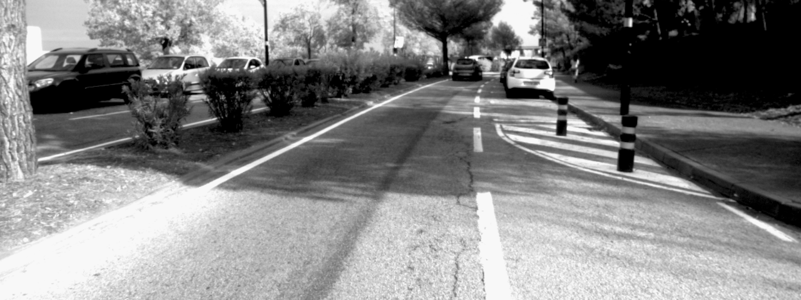
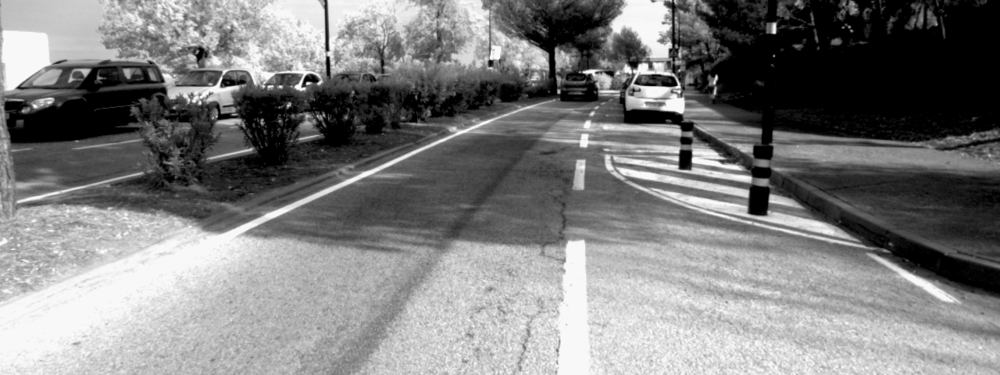
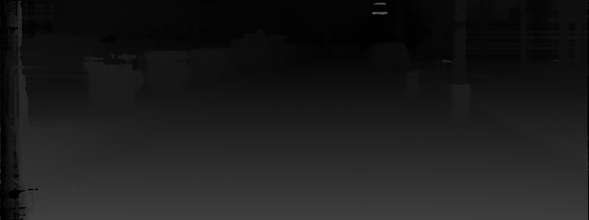

# Semi-Global Matching on the GPU

This is the implementation of [Embedded real-time stereo estimation via Semi-Global Matching on the GPU](http://www.sciencedirect.com/science/article/pii/S1877050916306561), [D. Hernandez-Juarez](http://danihernandez.eu) et al, ICCS 2016.

Performance obtained measured in Frames Per Second (FPS):

|                 |     2 paths   |     4 paths   |     8 paths     |
| -------------   |:-------------:|:-------------:|:---------------:|
| NVIDIA Tegra X1 | 81            |    42         |     19          |
| NVIDIA Titan X  | 886           |     475       |     237         |

Results for example image (left and right Images):




Results for example image (Output):



Parameters used for KITTI 2015:
- 2 path directions: P1=7, P2=84
- 4 path directions: P1=7, P2=86
- 8 path directions: P1=6, P2=96


## How to compile and test

Simply use CMake and target the output directory as "build". In command line this would be (from the project root folder):

```
mkdir build
cd build
cmake ..
make
```

Note: if this doesn't work for you, please modify CMakeLists.txt for your CUDA architecture!
Example: for RTX 3080 add "-gencode=arch=compute_86,code=sm_86"


## How to use it

Type: `./sgm dir p1 p2`

The arguments `p1` and `p2` are semi-global matching parameters, for more information read the SGM paper.

`dir` is the name of the directory which needs this format:

```
dir
---- left (images taken from the left camera)
---- right (right camera)
---- disparities (results will be here)
```

## Related Publications

[Embedded real-time stereo estimation via Semi-Global Matching on the GPU](http://www.sciencedirect.com/science/article/pii/S1877050916306561)
[D. Hernandez-Juarez](http://danihernandez.eu), A. Chacón, A. Espinosa, D. Vázquez, J. C. Moure, and A. M. López
ICCS2016 – International Conference on Computational Science 2016

## Requirements

- OpenCV
- CUDA
- CMake

## Limitations

- Maximum disparity has to be 128
- PATH_AGGREGATION parameter must be set to 4 or 8
- Image width and height must be a divisible by 4

## Troubleshooting

- Very fast execution and black disparity result: 
This is usually an error related to the compute architecture used. Look at the CMakeLists.txt and change the architecture to the one you are using, please. If you run the application with nvprof you will see that it does not run any CUDA kernel.

## What to cite

If you use this code for your research, please kindly cite:

```
@inproceedings{sgm_gpu_iccs2016,
  author    = {Daniel Hernandez-Juarez and
               Alejandro Chac{\'{o}}n and
               Antonio Espinosa and
               David V{\'{a}}zquez and
               Juan Carlos Moure and
               Antonio M. L{\'{o}}pez},
  title     = {Embedded Real-time Stereo Estimation via Semi-Global Matching on the
               {GPU}},
  booktitle = {International Conference on Computational Science 2016, {ICCS} 2016,
               6-8 June 2016, San Diego, California, {USA}},
  pages     = {143--153},
  year      = {2016},
  crossref  = {DBLP:conf/iccS/2016},
  url       = {http://dx.doi.org/10.1016/j.procs.2016.05.305},
  doi       = {10.1016/j.procs.2016.05.305},
  biburl    = {http://dblp.uni-trier.de/rec/bib/conf/iccS/JuarezCEVML16},
  bibsource = {dblp computer science bibliography, http://dblp.org}
}
```
